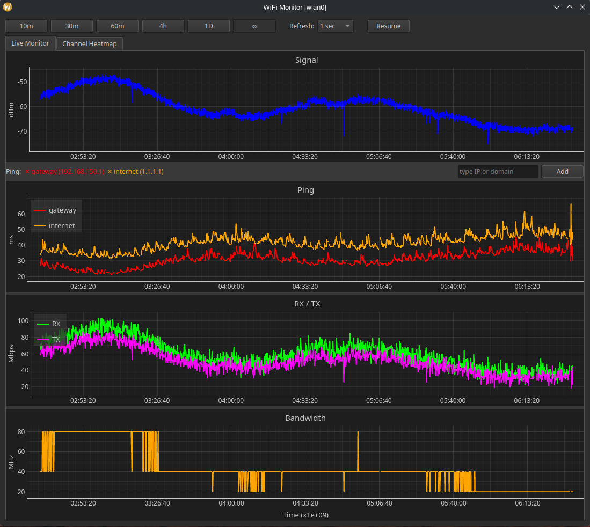
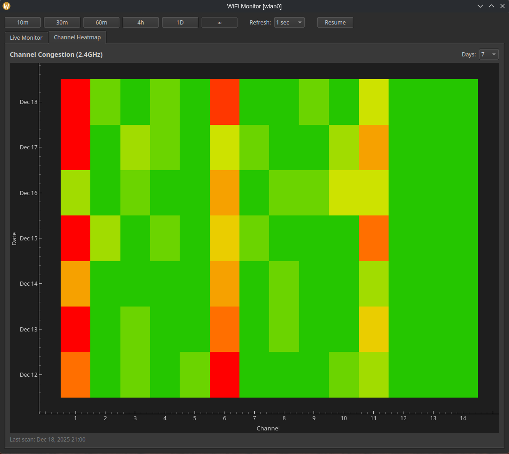

# WiFi Link & Latency Monitor

A lightweight Linux desktop app that graphs **Wi‑Fi link quality** and **network latency** over time.

It continuously samples Wi‑Fi metrics from `iw` and runs background pings to one or more hosts so you can correlate **signal / link rate changes** with **latency spikes** and **packet loss**.





## What it shows

- **Signal strength** (dBm)
- **RX / TX bitrate** (MBit/s)
- **Channel width / bandwidth** (MHz, when available from `iw`)
- **Ping latency** per host (ms), including failure periods
- **Channel congestion heatmap** (networks per channel over time)

## Features

- Multi-plot dashboard (Signal, Ping, RX/TX, Bandwidth)
- Channel congestion heatmap with historical data (7/14/30 days)
- Auto-detection of 2.4GHz and 5GHz bands
- Time window presets: **10m / 30m / 60m / 4h / 1D / ∞**
- Adjustable refresh interval
- Pause/Resume updates
- Add/remove ping targets (IP or domain)

## Requirements

- Linux
- Python 3.8+
- System tools:
  - `iw`
  - `ip` (iproute2)
  - `ping` (iputils)
  - `nmcli` (NetworkManager, for channel scanning)
- Python packages:
  - `PyQt5`
  - `pyqtgraph`
  - `numpy`
  - (optional) `PyOpenGL`, `PyOpenGL_accelerate` for GPU/OpenGL acceleration

## Installation

### Using venv (recommended)

```bash
# Clone the repository
git clone https://github.com/vdpopov/Wireless-Link-Quality-Dashboard.git
cd Wireless-Link-Quality-Dashboard

# Create virtual environment
python -m venv venv

# Activate virtual environment
source venv/bin/activate

# Install the package
pip install .

# Or for development (editable install)
pip install -e .

# Optional: Install with OpenGL acceleration
pip install ".[opengl]"
```

### System-wide

```bash
pip install .
```

## Run

After installation, run:

```bash
python -m wifi_monitor.main
```

On startup, you'll be prompted to choose a wireless interface.

## How it works (high level)

- Wi‑Fi metrics are parsed from:
  - `iw dev <iface> link`
- Default gateway is detected from:
  - `ip route`
- Ping latency is collected by background threads running:
  - `ping -c 1 -W 1 <host>`

## Notes / limitations

- This tool is intended for **local diagnostics** on a machine you control.
- Some Wi‑Fi drivers/APs may not report all fields (e.g., bandwidth), in which case those points will appear as gaps.

